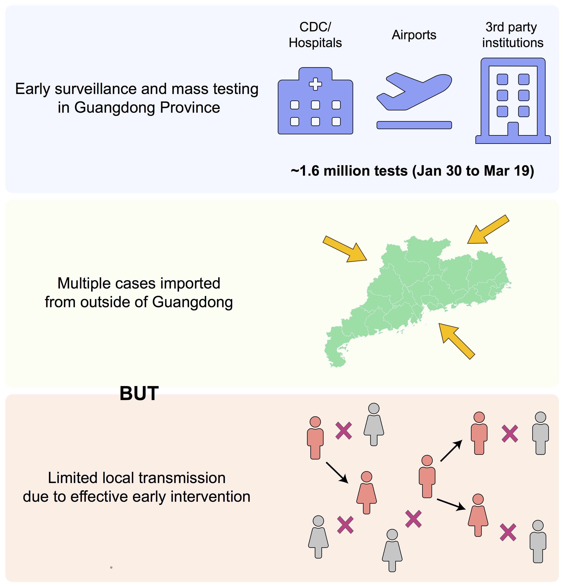

# Genomic epidemiology of SARS-CoV-2 in Guangdong Province, China

### Jing Lu, Louis du Plessis, Zhe Liu, Verity Hill, Min Kang, Huifang Lin, Jiufeng Sun, Sarah François, Moritz U G Kraemer, Nuno R Faria, John T McCrone,  Jingju Peng, Qianlin Xiong, Runyu Yuan, Lilian Zeng, Pingping Zhou, Chuming Liang, Lina Yi, Jun Liu, Jianpeng Xiao, Jianxiong Hu, Tao Liu, Wenjun Ma, Wei Li, Juan Su, Huanying Zheng, Bo Peng, Shisong Fang, Wenzhe Su, Kuibiao Li, Ruilin Sun, Ru bai, Xi Tang, Minfeng Liang, Josh Quick, Tie Song, Andrew Rambaut, Nick Loman, Jayna Raghwani, Oliver G Pybus, Changwen Ke

This repository contains the data files, configuration files, log files, tree files and scripts necessary to reproduce the analyses and figures presented in [https://doi.org/10.1101/2020.04.01.20047076](https://doi.org/10.1101/2020.04.01.20047076). Some of the scripts may need some adjustment depending on the local setup. 

Note that because of the GISAID [terms of use](https://www.gisaid.org/registration/terms-of-use/) genomic sequences cannot be shared in this repository. Instead, we make the GISAID accessions available and provide a table of acknowledgements. 

## Highlights
- 1.6 million molecular diagnostic tests identified 1,388 SARS-CoV-2 infections in Guangdong Province, China, by 19th March 2020 
- Virus genomes can be recovered using a variety of sequencing approaches from a range of patient samples. 
- Genomic analyses reveal multiple virus importations into Guangdong Province, resulting in genetically distinct clusters that require careful interpretation.
- Large-scale epidemiological surveillance and intervention measures were effective in interrupting community transmission in Guangdong

## Summary
_COVID-19 is caused by the SARS-CoV-2 coronavirus and was first reported in central China in December 2019. Extensive molecular surveillance in Guangdong, China’s most populous province, during early 2020 resulted in 1,388 reported RNA-positive cases from 1.6 million tests. In order to understand the molecular epidemiology and genetic diversity of SARS-CoV-2 in China we generated 53 genomes from infected individuals in Guangdong using a combination of metagenomic sequencing and tiling amplicon approaches. Combined epidemiological and phylogenetic analyses indicate multiple independent introductions to Guangdong, although phylogenetic clustering is uncertain due to low virus genetic variation early in the pandemic. Our results illustrate how the timing, size and duration of putative local transmission chains were constrained by national travel restrictions and by the province’s large-scale intensive surveillance and intervention measures. Despite these successes, COVID-19 surveillance in Guangdong is still required as the number of cases imported from other countries has increased._

## Dependencies

- PhyML v3.3
- BEAST v1.10.4
- BioPython
- ggplot2, ggtree, treeio, coda, gplots, cowplot, lubridate, phytools
- [figtreejs-react](https://github.com/jtmccr1/figtreejs-react): Commit #96534dc
- [beastio](https://github.com/laduplessis/beastio): Commit #b18caa6

## Data

1. [cases-guangdong.csv](https://github.com/laduplessis/SARS-CoV-2_Guangdong_genomic_epidemiology/blob/master/data/cases_guangdong.csv): Numbers of reported cases in Guangdong.
2. `data/samples.csv`: Sequencing samples collected in Guangdong.
3. `data/sequences.csv`: Statistics of sequences generated from the samples in `samples.csv`.
4. `data/final_alignment_GDHB.csv`: Taxon labels of sequences from Guangdong and Hubei in the final alignment.
5. `data/GISAID_acknowledgements.txt`: Sequences used in the analyses.

## Phylogenetic analyses

1. To build the maximum likelihood tree in PhyML: `phyml -i final_alignment_250.phy --quiet --run_id HKY+G`
2. To run the BEAST analysis run the XML file in `results/beast/` (after adding in the genome sequences).
3. To extract the SNP and gap statistics (for the mutational panel in Figure 2), create an alignment that is trimmed to the reference (MN908847.3) with the reference as the first sequence in the alignment and run: `python scripts/msastats.py -i results/alignments/final_alignment_trimmedToMN908947.fasta -f "|" -s 1 -o results/alignments/ -g`

## MCC tree figure
An interactive version of Figure 3B with options to zoom in on clades and
can toggle between lineage and location annotations can be found [here](https://laduplessis.github.io/SARS-CoV-2_Guangdong_genomic_epidemiology/).
The source code for the visualization as well as instructions for running the visualization locally
is in the scripts directory. 

## Other figures
To reproduce the other figures, run the notebook `scripts/Figures.Rmd`, which creates `Figures.pdf`. Note that the notebook requires the SNP and gap statistics of the alignment for some figures, which are not stored on the repository (because of GISAID terms of use). 

